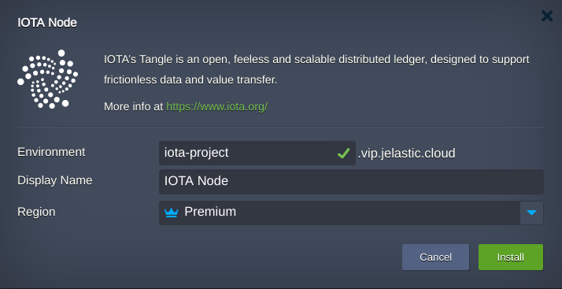
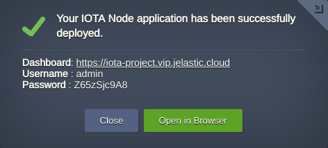

# IOTA

IOTA is an open source, feeless, and scalable distributed ledger technology, designed to support frictionless data and value transfer.  
    
## IOTA Node Package Options

 - Built-in Let’s Encrypt companion for assigning SSL certificates via acme.sh
 - NGINX proxy
 - Basic authentication
 - Automatic vertical scaling

## Installation

Get your Jelastic account at any of available [hosting provider](https://jelastic.cloud/).

Click the **DEPLOY TO JELASTIC** button, specify your email address within the widget and press **Install**.

<a href="https://jelastic.com/install-application/?manifest=https://raw.githubusercontent.com/jelastic-jps/iota-node/main/manifest.yaml">

</a>  
      
If required change **Environment** Name and Destination **Region** if several are available.

Once the installation is completed you may proceed to the IOTA dashboard by pressing **Open in Browser** button in a successful installation window.  

